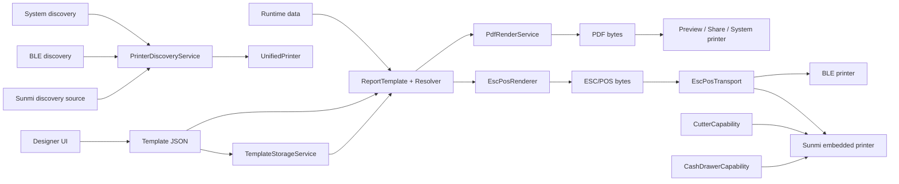

# Code Walkthrough

This document explains the current `flutter_report_suite` architecture after Phase 3, including template authoring, PDF rendering, Thai ESC/POS, printer discovery, transport adapters, Sunmi integration, hardware capabilities, tests, and CI boundaries.

## 1. Repository map

```text
flutter_report_suite/
├── .github/workflows/ci.yml
├── apps/
│   └── designer/
│       ├── android/ ios/ web/ macos/ windows/ linux/
│       ├── assets/templates/
│       ├── lib/
│       │   ├── main.dart
│       │   ├── controllers/
│       │   ├── models/
│       │   ├── pages/
│       │   ├── services/
│       │   └── widgets/
│       └── test/
├── packages/
│   ├── report_engine/
│   │   ├── assets/fonts/
│   │   ├── assets/templates/
│   │   ├── example/
│   │   ├── lib/
│   │   │   ├── report_engine.dart
│   │   │   └── src/
│   │   │       ├── models/report_template.dart
│   │   │       ├── services/
│   │   │       │   ├── report_value_resolver.dart
│   │   │       │   ├── pdf_render_service.dart
│   │   │       │   └── template_storage_service.dart
│   │   │       └── printer/
│   │   │           ├── capabilities/
│   │   │           ├── discovery/
│   │   │           ├── encoding/
│   │   │           ├── rendering/
│   │   │           ├── transport/
│   │   │           ├── printer_service.dart
│   │   │           └── esc_pos_printer_service.dart
│   │   └── test/
│   └── report_engine_sunmi/
│       ├── lib/
│       │   ├── report_engine_sunmi.dart
│       │   └── src/
│       │       ├── sunmi_printer_adapter.dart
│       │       └── sunmi_printer_bridge.dart
│       └── test/
└── docs/
    ├── CODE_WALKTHROUGH.md
    ├── PHASE3_SUNMI_ADAPTER_AUDIT.md
    └── PHASE3_TASK9_11_VALIDATION.md
```

The dependency direction is intentional:

```text
apps/designer
      ↓
report_engine
      ↑
report_engine_sunmi
```

`report_engine` is the cross-platform core. The Designer consumes it. Android-only Sunmi support lives in a companion package so the core does not acquire an Android-only plugin dependency.

---

## 2. End-to-end architecture



The important Phase 3 boundary is:

> Rendering produces bytes. Transport sends bytes. Hardware capabilities perform device-specific operations.

These concerns are intentionally separate.

---

## 3. Public engine API

Canonical import:

```dart
import 'package:report_engine/report_engine.dart';
```

`report_engine.dart` exports the supported application-facing API including:

- report template models
- `ReportValueResolver`
- `PdfRenderService`
- `TemplateStorageService`
- `FlutterReportPrinter`
- `EscPosPrinterService`
- Thai ESC/POS encoding configuration
- ESC/POS renderer and rasterizer
- ESC/POS transport contract
- unified printer discovery
- hardware capability contracts

The public core API does not expose a Sunmi plugin dependency. Applications that target Sunmi import the companion package separately:

```dart
import 'package:report_engine_sunmi/report_engine_sunmi.dart';
```

---

## 4. Template contract

File:

```text
packages/report_engine/lib/src/models/report_template.dart
```

The shared contract consists of `PaperConfig`, `ReportElement`, and `ReportTemplate`.

Geometry is persisted in physical millimeters:

```text
model geometry = millimeters
screen geometry = millimeters × zoom scale
PDF geometry = millimeters → PDF points
```

This rule lets Designer zoom without mutating the saved document geometry.

A dynamic element example:

```json
{
  "id": "shop-name",
  "type": "dynamic_text",
  "key": "{{shop.name}}",
  "x": 5,
  "y": 5,
  "w": 70,
  "h": 8,
  "style": {
    "fontSize": 14,
    "bold": true,
    "align": "center"
  }
}
```

The same JSON drives PDF and ESC/POS output.

---

## 5. Value resolution

File:

```text
packages/report_engine/lib/src/services/report_value_resolver.dart
```

`ReportValueResolver` supports nested maps, list indexes, and interpolation.

```dart
const resolver = ReportValueResolver();

resolver.resolve('{{shop.name}}', data);
resolver.resolve('{{items.0.name}}', data);
resolver.resolveText('Invoice {{invoiceNo}}', data);
```

Missing, null, invalid, negative, or out-of-range paths resolve safely rather than crashing the renderer.

PDF and ESC/POS both use this resolver so expression semantics stay consistent across output channels.

---

## 6. PDF rendering and Thai fonts

File:

```text
packages/report_engine/lib/src/services/pdf_render_service.dart
```

Primary API:

```dart
final bytes = await PdfRenderService().render(templateJson, data);
```

The renderer:

1. parses the template
2. resolves dynamic data
3. loads bundled fonts
4. converts millimeter geometry to PDF units
5. builds thermal or paged PDF output
6. returns `Uint8List`

Bundled Thai fonts live under:

```text
packages/report_engine/assets/fonts/
├── NotoSansThai-Regular.ttf
└── NotoSansThai-Bold.ttf
```

Package-aware asset paths are used so Thai rendering works when `report_engine` is consumed by another Flutter application.

`PdfRenderService` never performs physical printer operations such as cutting paper or opening a cash drawer.

---

## 7. System printer facade

File:

```text
packages/report_engine/lib/src/printer/printer_service.dart
```

`FlutterReportPrinter` is the high-level PDF/system-printing facade:

```dart
final printer = FlutterReportPrinter();

final bytes = await printer.generatePdf(
  templateJson: template,
  data: data,
);
```

It also provides preview/share/direct-print/system-printer listing behavior through the `printing` package.

This is separate from ESC/POS thermal printing.

---

## 8. ESC/POS architecture

Phase 3 splits ESC/POS into four layers:

```text
Template + data
      ↓
EscPosRenderer
      ↓
ESC/POS bytes
      ↓
EscPosTransport
      ↓
physical connection
```

Additional device operations are separate:

```text
CutterCapability
CashDrawerCapability
```

### Renderer

File:

```text
packages/report_engine/lib/src/printer/rendering/esc_pos_renderer.dart
```

`EscPosRenderer` owns ESC/POS document rendering. It does not connect to Bluetooth and does not cut paper.

Example:

```dart
final renderer = EscPosRenderer();

final bytes = await renderer.renderTemplate(
  template: template,
  data: data,
  encodingConfig: const EscPosEncodingConfig.raster(),
);
```

`renderQuickReceipt()` is the convenience path for simple receipts without template JSON.

### Transport

File:

```text
packages/report_engine/lib/src/printer/transport/esc_pos_transport.dart
```

Contract:

```dart
abstract interface class EscPosTransport {
  Future<void> send(List<int> bytes);
}
```

Rendering code therefore does not care whether bytes are sent through BLE, an embedded Sunmi service, network transport, USB, or a future adapter.

---

## 9. Thai ESC/POS strategies

Files:

```text
packages/report_engine/lib/src/printer/encoding/
├── thai_encoding.dart
├── esc_pos_encoding_config.dart
└── esc_pos_text_encoder.dart
```

Supported strategies:

```dart
enum ThaiEncoding {
  tis620,
  cp874,
  rasterImage,
}
```

### TIS-620

Use when the target printer manual confirms a compatible code table.

```dart
const encoding = EscPosEncodingConfig.tis620(
  codeTable: 26,
);
```

### CP874

Use when the printer exposes a Windows-874/CP874-compatible table.

```dart
const encoding = EscPosEncodingConfig.cp874(
  codeTable: 30,
);
```

The code-table number is printer-specific and is deliberately supplied by configuration rather than hardcoded globally.

### Raster fallback

Use when Thai code-page behavior is unknown or unreliable:

```dart
const encoding = EscPosEncodingConfig.raster();
```

This converts text into a monochrome ESC/POS raster image and avoids printer-side Thai character mapping.

Required Thai fixtures are covered by tests, including:

```text
กุ้ง
น้ำ
ยอดรวม
mixed Thai / English
Thai numerals
```

Automated byte-level coverage does not prove that a particular physical printer renders the bytes correctly. Physical printer compatibility remains a separate verification step.

---

## 10. Rasterized Thai text

File:

```text
packages/report_engine/lib/src/printer/rendering/esc_pos_rasterizer.dart
```

`FlutterEscPosRasterizer` uses Flutter text rendering with the bundled Noto Sans Thai font, converts the result to RGBA pixels, thresholds it to monochrome, packs bits, and emits ESC/POS `GS v 0` raster bytes.

Conceptually:

```text
Thai String
   ↓
TextPainter + Noto Sans Thai
   ↓
Flutter image
   ↓
RGBA pixels
   ↓
monochrome bitmap
   ↓
GS v 0 ESC/POS bytes
```

This is the compatibility fallback for printers whose firmware does not reliably provide the required Thai code page.

---

## 11. Bluetooth ESC/POS transport

File:

```text
packages/report_engine/lib/src/printer/transport/bluetooth_esc_pos_transport.dart
```

`BluetoothEscPosTransport` owns BLE-specific behavior:

1. connect to the device
2. discover services
3. find a writable characteristic
4. split the output into bounded chunks
5. write chunks
6. disconnect in cleanup

This transport uses `flutter_blue_plus`, which is BLE-only. Bluetooth Classic printers are not covered by this adapter and require a different transport/discovery implementation.

The legacy `scanPrinters()` API remains for compatibility, but new multi-mechanism discovery should use `PrinterDiscoveryService`.

---

## 12. Unified printer discovery

Files:

```text
packages/report_engine/lib/src/printer/discovery/
├── unified_printer.dart
├── printer_discovery_source.dart
├── printer_discovery_service.dart
├── system_printer_discovery.dart
└── bluetooth_printer_discovery.dart
```

Domain model:

```dart
enum PrinterConnectionType {
  system,
  usb,
  network,
  bluetooth,
  embedded,
}

class UnifiedPrinter {
  final String id;
  final String name;
  final PrinterConnectionType type;
  final Map<String, String> metadata;
}
```

The domain model deliberately does not expose `printing.Printer`, `BluetoothDevice`, or Sunmi plugin objects.

Discovery sources implement:

```dart
abstract interface class PrinterDiscoverySource {
  Future<List<UnifiedPrinter>> discover();
}
```

The aggregator:

```dart
final discovery = PrinterDiscoveryService.standard();
final printers = await discovery.discoverAll();
```

`discoverAll()` provides:

- source isolation: one plugin failure does not suppress other results
- deterministic IDs where available
- deduplication by ID
- deterministic ordering
- optional additional sources

Additional adapters such as Sunmi can be injected without changing the core service.

---

## 13. Sunmi companion package

Package:

```text
packages/report_engine_sunmi/
```

Sunmi support is isolated because `sunmi_printer_plus` is Android-only.

`SunmiPrinterAdapter` implements multiple core contracts:

```text
EscPosTransport
PrinterDiscoverySource
CutterCapability
CashDrawerCapability
```

This means a single adapter can:

- send rendered ESC/POS bytes to the embedded printer
- participate in unified discovery
- cut paper when supported by the Sunmi device
- open the cash drawer when supported

Example:

```dart
final sunmi = SunmiPrinterAdapter();
final renderer = EscPosRenderer();

final bytes = await renderer.renderQuickReceipt(
  data: data,
  encodingConfig: const EscPosEncodingConfig.raster(),
);

await sunmi.send(bytes);
await sunmi.cutPaper();
```

Unified discovery with Sunmi:

```dart
final sunmi = SunmiPrinterAdapter();

final discovery = PrinterDiscoveryService.standard(
  additionalSources: <PrinterDiscoverySource>[sunmi],
);

final printers = await discovery.discoverAll();
```

`rebindPrinter()` is also exposed for recovery when the Android Sunmi printer service is not ready or has been killed.

See `docs/PHASE3_SUNMI_ADAPTER_AUDIT.md` for dependency/platform analysis.

---

## 14. Hardware capabilities

File:

```text
packages/report_engine/lib/src/printer/capabilities/printer_hardware_capabilities.dart
```

Contracts:

```dart
abstract interface class CutterCapability {
  Future<void> cutPaper();
}

abstract interface class CashDrawerCapability {
  Future<void> openCashDrawer();
}
```

The core rule is:

> A transport is not automatically a cutter, and a printer is not automatically a cash drawer controller.

For example, `EscPosPrinterService.printReceiptWithTransport()` may receive an explicit `CutterCapability`. If cutting is requested but no cutter capability is supplied, the operation fails cleanly before output is sent.

This prevents assumptions such as “all Bluetooth receipt printers support cut”.

The intended sequence is:

```text
render
  ↓
send bytes
  ↓
cutPaper() only when explicit capability exists
```

Quick-receipt and renderer output contain no implicit cut command.

---

## 15. EscPosPrinterService orchestration

File:

```text
packages/report_engine/lib/src/printer/esc_pos_printer_service.dart
```

The service now orchestrates rendering + transport rather than owning every printer concern.

Conceptual call:

```dart
await service.printReceiptWithTransport(
  transport: transport,
  templateJson: templateJson,
  data: data,
  encodingConfig: encoding,
  cutAfterPrint: true,
  cutter: cutter,
);
```

Responsibilities:

```text
EscPosPrinterService
├── parse template
├── invoke EscPosRenderer
├── send through EscPosTransport
└── optionally invoke explicit CutterCapability
```

It does not generate legacy cut bytes itself anymore.

The direct Bluetooth entry point remains as a compatibility facade, but cutting is not assumed for generic Bluetooth printers.

---

## 16. Offline template storage

File:

```text
packages/report_engine/lib/src/services/template_storage_service.dart
```

Hive stores template JSON locally.

```dart
final storage = TemplateStorageService();
await storage.init();
await storage.saveTemplate('receipt', template);
final cached = await storage.getTemplate('receipt');
```

Designer lifecycle operations build on this service for create/save/save-as/rename/load/delete/duplicate workflows.

Rendering remains storage-agnostic.

---

## 17. Designer V2

The Designer now includes:

- template gallery
- built-in 80mm, 58mm, A4, and 4x6 templates
- persistent template lifecycle
- JSON import/export/share
- table column editor
- 5mm snap-to-grid
- center guides
- millimeter rulers
- 50%–200% zoom
- undo/redo
- keyboard shortcuts

The central invariant remains:

```text
saved geometry = physical millimeters
zoom = presentation only
```

PDF preview uses the same template JSON consumed by external applications, making preview an integration test of the shared contract rather than a separate rendering implementation.

---

## 18. Test boundaries

### Core engine

Important Phase 3 suites include:

```text
esc_pos_text_encoder_test.dart
esc_pos_renderer_test.dart
esc_pos_printer_service_capability_test.dart
printer_discovery_service_test.dart
```

They verify:

- TIS-620 / CP874 byte mappings
- Thai raster selection
- renderer output does not implicitly cut
- transport + cutter ordering
- missing cutter capability fails safely
- discovery aggregation/deduplication/error isolation/order

Existing engine suites continue to cover template parsing, value resolution, PDF structure, Thai PDF, multi-page rendering, storage, and system-printer facade behavior.

### Sunmi package

```text
packages/report_engine_sunmi/test/sunmi_printer_adapter_test.dart
```

It verifies bridge delegation, embedded discovery, transport behavior, cutter/cash-drawer capability conformance, and rebind behavior without requiring physical hardware.

### Example application

The example tests validate that public API actions render correctly in the consuming application, including legacy and Thai-raster ESC/POS generation paths.

### Designer

Designer tests cover gallery/lifecycle/editor/history/geometry/responsive behavior and keep document-authoring regressions isolated from printer-plugin tests.

---

## 19. Validation status vs physical compatibility

Phase 3 software validation covers:

```text
format
analyze
unit/widget tests
example Android build
Sunmi companion package tests
```

This proves the software contracts and compile/test boundaries.

It does **not** prove physical compatibility with a specific printer model.

Examples of hardware evidence still requiring a real device:

- XP-80 CP874 code-table number
- XP-58 Thai code-page behavior
- Epson TM-T88V Thai output
- real cutter behavior
- real cash drawer pulse behavior
- Sunmi V2 print/cut/drawer behavior

Until tested on hardware, such cases remain:

```text
NEEDS PHYSICAL VERIFICATION
```

---

## 20. Debugging map

```text
Template/resolver test fails
    -> report contract or expression semantics

PDF test fails
    -> PdfRenderService / fonts / PDF dependency

Thai ESC/POS bytes wrong
    -> EscPosTextEncoder / encoding config

Thai raster wrong
    -> FlutterEscPosRasterizer / bundled font path

ESC/POS document layout wrong
    -> EscPosRenderer

Bytes correct but BLE printer fails
    -> BluetoothEscPosTransport / BLE permissions / device behavior

Discovery misses one mechanism
    -> corresponding PrinterDiscoverySource

One discovery plugin crashes all discovery
    -> PrinterDiscoveryService isolation regression

Cut requested but unavailable
    -> missing CutterCapability; do not add implicit cut bytes

Sunmi-specific failure
    -> report_engine_sunmi bridge/plugin/device service

Designer behavior fails
    -> Designer controller/page/widgets
```

---

## 21. Where to change code

| Requirement | Primary location |
| --- | --- |
| Add template field | `report_template.dart` |
| Change expression behavior | `report_value_resolver.dart` |
| Add PDF behavior | `pdf_render_service.dart` |
| Change system printing | `printer_service.dart` |
| Change ESC/POS document layout | `rendering/esc_pos_renderer.dart` |
| Change Thai code-page mapping | `encoding/esc_pos_text_encoder.dart` |
| Change raster Thai output | `rendering/esc_pos_rasterizer.dart` |
| Add connection mechanism | implement `EscPosTransport` |
| Add discovery mechanism | implement `PrinterDiscoverySource` |
| Change discovery aggregation | `printer_discovery_service.dart` |
| Add cut support | implement `CutterCapability` in compatible adapter |
| Add cash drawer support | implement `CashDrawerCapability` in compatible adapter |
| Change BLE behavior | `bluetooth_esc_pos_transport.dart` |
| Change Sunmi behavior | `packages/report_engine_sunmi/` |
| Change offline persistence | `template_storage_service.dart` |
| Change Designer authoring | `apps/designer/lib/` |
| Change CI gates | `.github/workflows/ci.yml` |

A new printer integration should normally compose existing contracts instead of modifying renderers:

```text
new adapter
  ├── EscPosTransport          if it sends ESC/POS bytes
  ├── PrinterDiscoverySource   if it can be discovered
  ├── CutterCapability         if it can cut
  └── CashDrawerCapability     if it controls a drawer
```

This is the primary extension point established by Phase 3.

---

## 22. Phase boundary

Phase 3 implementation and maintainer-confirmed local validation are complete for Tasks 9–12.

Before Phase 4 starts, the Phase 3 branch must go through PR review and CI and then merge into `main` according to the repository phase-boundary rule.

Physical printer validation remains a separate evidence track and is not a blocker for software architecture completion, but no hardware compatibility claim may be made without that evidence.
