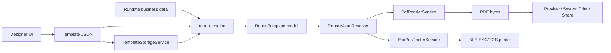

# Code Walkthrough

This document explains how `flutter_report_suite` is structured after the refactor and how data moves from the visual Designer to PDF, system printing, and ESC/POS output.

## 1. Repository overview

```text
flutter_report_suite/
├── .github/workflows/ci.yml
├── apps/
│   └── designer/
│       ├── assets/templates/
│       ├── lib/main.dart
│       └── lib/pages/designer_page.dart
├── packages/
│   └── report_engine/
│       ├── assets/templates/
│       ├── example/
│       ├── lib/
│       │   ├── report_engine.dart
│       │   └── src/
│       │       ├── models/report_template.dart
│       │       ├── printer/
│       │       │   ├── esc_pos_printer_service.dart
│       │       │   └── printer_service.dart
│       │       └── services/
│       │           ├── pdf_render_service.dart
│       │           ├── report_value_resolver.dart
│       │           └── template_storage_service.dart
│       └── test/
│           ├── report_template_test.dart
│           └── report_value_resolver_test.dart
└── docs/
    ├── CI.md
    └── CODE_WALKTHROUGH.md
```

The repository has two main responsibilities:

- `apps/designer`: author template JSON visually.
- `packages/report_engine`: consume template JSON plus runtime data and produce output.

The important architectural rule is that the Designer does not invent a second report format. It creates the same JSON contract that `report_engine` consumes.

---

## 2. End-to-end flow



Example runtime data:

```dart
final data = {
  'shop': {
    'name': 'Dexter Coffee',
    'branch': 'Nimman',
  },
  'orderId': 'ORD-001',
  'items': [
    {'name': 'Latte', 'qty': 2, 'price': 65},
  ],
  'total': 130,
};
```

Example template expression:

```json
{
  "id": "shop-name",
  "type": "dynamic_text",
  "key": "{{shop.name}}",
  "x": 5,
  "y": 5,
  "w": 70,
  "h": 8,
  "style": {
    "fontSize": 14,
    "bold": true,
    "align": "center"
  }
}
```

At render time, `{{shop.name}}` resolves to `Dexter Coffee`.

---

## 3. Public package API

File:

```text
packages/report_engine/lib/report_engine.dart
```

This is the canonical package entrypoint:

```dart
import 'package:report_engine/report_engine.dart';
```

It exports only the package concepts applications are expected to use:

- report template models
- value resolver
- PDF renderer
- template storage
- system printer facade
- ESC/POS printer service

The old `flutter_offline_report.dart` file remains only as a compatibility export for older code. New code should import `report_engine.dart` through the package import above.

Why this matters: before the refactor, the package directory was called `report_engine`, the Designer depended on `report_engine`, but the package itself was named `flutter_offline_report`. A single canonical package identity removes that ambiguity.

---

## 4. Template model layer

File:

```text
packages/report_engine/lib/src/models/report_template.dart
```

The model layer converts loosely typed JSON into objects the renderers can trust.

### `PaperConfig`

Represents output paper configuration:

```text
type
widthMm
heightMm
autoHeight
marginMm
```

Typical examples:

- thermal 58 mm
- thermal 80 mm
- A4 210 × 297 mm
- custom PDF dimensions

### `ReportElement`

Represents one item placed in a template.

Important fields:

```text
id       unique element identifier
type     text / dynamic_text / line / table / qrcode / barcode
key      literal text or data expression
x, y     position in millimeters
w, h     size in millimeters
style    rendering options
columns  table column definitions
```

The Designer and engine both treat geometry as millimeters. Conversion to PDF points belongs inside the PDF renderer, not inside the Designer.

### `ReportTemplate`

The root object combines:

```text
id
version
paper
elements
```

Parsing is defensive. Missing optional values receive sensible defaults instead of forcing every caller to validate raw JSON manually.

The model also supports `toJson()`, so parsed templates can be serialized back to the canonical format.

---

## 5. Value resolution

File:

```text
packages/report_engine/lib/src/services/report_value_resolver.dart
```

`ReportValueResolver` is intentionally small, but it is an important boundary.

```dart
const resolver = ReportValueResolver();

final value = resolver.resolve(
  '{{shop.name}}',
  {
    'shop': {'name': 'Dexter Coffee'},
  },
);
```

Result:

```text
Dexter Coffee
```

It supports nested paths by walking maps segment by segment:

```text
shop.name
customer.address.city
order.payment.reference
```

If a path does not exist, the resolver returns an empty value rather than throwing.

### Why this was extracted

Previously PDF rendering and ESC/POS printing each implemented their own nested-key resolver. That creates subtle differences over time. One shared resolver means all output channels interpret template expressions the same way.

### Literal text versus dynamic text

The element type determines whether the `key` is data-driven.

For example:

```json
{
  "type": "text",
  "key": "Thank you"
}
```

is literal content.

Whereas:

```json
{
  "type": "dynamic_text",
  "key": "{{customer.name}}"
}
```

is resolved from runtime data.

This distinction fixes a problem in the original implementation where ordinary text could accidentally be treated as a data path.

---

## 6. PDF rendering

File:

```text
packages/report_engine/lib/src/services/pdf_render_service.dart
```

Primary API:

```dart
final bytes = await PdfRenderService().render(templateJson, data);
```

The renderer performs four major steps:

1. Load fonts.
2. Parse JSON into `ReportTemplate`.
3. Resolve values from runtime data.
4. Build a `pdf` package document and return `Uint8List` bytes.

### Thermal documents

Thermal output uses the configured paper width and a content-driven page height.

The template continues to use millimeters. The PDF renderer converts those dimensions using `PdfPageFormat.mm`.

Supported element concepts include:

- text
- dynamic text
- separator line
- table
- QR code
- Code 128 barcode

### A4 and custom PDF

Paged documents use `MultiPage`, allowing long tables and content to flow across pages.

Page-level concerns such as margins, headers, footers, and page numbers belong here rather than in the Designer UI.

### Font behavior

The renderer attempts to load Thai fonts from assets. If those fonts are not available, it falls back to PDF built-in fonts rather than crashing initialization.

A production application that requires Thai output should still bundle the intended Thai font assets explicitly.

---

## 7. System printer facade

File:

```text
packages/report_engine/lib/src/printer/printer_service.dart
```

`FlutterReportPrinter` is the application-facing facade around PDF rendering and the `printing` package.

Typical usage:

```dart
final printer = FlutterReportPrinter();

final pdf = await printer.generatePdf(
  templateJson: template,
  data: data,
);
```

Other operations:

```text
preview()
printDirect()
sharePdf()
listPrinters()
```

The renderer can be injected, which makes the facade easier to test and removes the hard dependency on constructing its own renderer internally.

### Direct system printing

The caller must provide a real `Printer` selected from `listPrinters()`.

This is safer than manufacturing an empty printer URL and hoping the platform resolves it.

Conceptually:

```dart
final printers = await printer.listPrinters();
final selected = printers.first;

await printer.printDirect(
  printer: selected,
  templateJson: template,
  data: data,
);
```

---

## 8. ESC/POS Bluetooth printing

File:

```text
packages/report_engine/lib/src/printer/esc_pos_printer_service.dart
```

ESC/POS output bypasses PDF entirely.

Flow:

```text
template + data
    ↓
ReportValueResolver
    ↓
esc_pos_utils_plus Generator
    ↓
ESC/POS bytes
    ↓
BLE writable characteristic
    ↓
thermal printer
```

### Printer scan

`scanPrinters()` uses `flutter_blue_plus` to collect scan results for a bounded duration.

The scan subscription is cancelled after scanning instead of leaving a listener alive indefinitely.

### Printing lifecycle

The service:

1. connects to the Bluetooth device
2. discovers services
3. finds a writable characteristic
4. creates ESC/POS bytes
5. writes bytes in chunks
6. disconnects in `finally`

The cleanup step is important because printing failures should not leave the BLE connection open.

### Chunking

BLE writes are split into approximately 180-byte chunks.

This avoids sending an arbitrarily large receipt buffer in one write and matches the constraints commonly encountered with BLE printer characteristics.

### Table output

Table elements use their configured columns instead of blindly printing the first and last values from each map. That keeps ESC/POS semantics closer to PDF table semantics.

### Quick receipt helper

`buildQuickReceipt()` remains available for applications that need a conventional receipt without constructing a complete template first.

It is a convenience API; template-based printing should remain the primary path when consistent Designer/PDF/ESC-POS output is required.

---

## 9. Offline template storage

File:

```text
packages/report_engine/lib/src/services/template_storage_service.dart
```

This service stores template JSON in Hive.

Typical lifecycle:

```dart
final storage = TemplateStorageService();
await storage.init();

await storage.saveTemplate('receipt', template);
final cached = await storage.getTemplate('receipt');
```

Other operations include:

```text
loadFromAssets()
getAllTemplateIds()
deleteTemplate()
```

The service reuses one typed Hive box after initialization rather than reopening the same box on every call.

This keeps persistence concerns outside the renderer. `PdfRenderService` does not need to know whether a template came from assets, Hive, an API, or an in-memory object.

---

## 10. Designer application

Main files:

```text
apps/designer/lib/main.dart
apps/designer/lib/pages/designer_page.dart
```

`main.dart` only owns application setup and launches `DesignerPage`.

Most behavior currently lives in `DesignerPage`.

### Designer state

The page tracks:

```text
paper type
paper width / height
auto-height flag
elements
selected element
mock preview data
```

### Adding elements

The Designer supports:

```text
Text
Dynamic field
Line
Table
QR code
Barcode
```

New table elements receive a valid default column schema so the exported JSON is renderable immediately.

### Canvas

The canvas renders the current paper as a scaled visual surface.

Important invariant:

```text
model geometry = millimeters
canvas geometry = millimeters × visual scale
```

Dragging divides screen-pixel movement by the canvas scale before writing back into the model.

This prevents UI scale from leaking into the persisted template JSON.

### Selection and editing

Selecting an element exposes editable properties such as:

```text
key/text
x
y
width
height
font size
bold
alignment
```

Input widgets use stable form state instead of constructing new `TextEditingController` instances on every widget rebuild.

### Preview

PDF preview calls the same `FlutterReportPrinter` package API an actual consuming application would use:

```text
Designer template JSON
        +
mock runtime data
        ↓
report_engine
        ↓
PDF preview
```

This is important because it acts as a compatibility check between Designer output and engine input.

### Export

Export JSON serializes the current in-memory template structure.

That JSON can then be:

- stored in Hive
- sent to an API
- bundled as an asset
- loaded by another Flutter application

No code generation is required to use a newly designed template.

---

## 11. Example application

Path:

```text
packages/report_engine/example/
```

The example demonstrates package consumption without the Designer.

It loads predefined JSON templates from assets, supplies mock business data, generates PDFs, and opens previews.

Use it when debugging the engine independently from Designer behavior.

This separation is useful when diagnosing failures:

```text
Example fails      -> likely engine/template problem
Example works,
Designer fails     -> likely Designer/export problem
PDF works,
ESC/POS fails      -> likely BLE/printer transport problem
```

---

## 12. Tests

Current package tests:

```text
packages/report_engine/test/report_template_test.dart
packages/report_engine/test/report_value_resolver_test.dart
```

### Template tests

Verify that templates:

- parse normal JSON
- preserve important values
- serialize back to JSON
- survive missing optional values using defaults

### Resolver tests

Verify nested-path behavior and missing values independently from PDF or Bluetooth code.

This is deliberately a pure unit boundary: business/template expression semantics can be tested without a printer, Flutter view, or PDF preview.

---

## 13. CI relationship

Workflow:

```text
.github/workflows/ci.yml
```

The package gate runs:

```bash
flutter pub get
flutter analyze
flutter test --reporter expanded
```

The Designer gate runs:

```bash
flutter pub get
flutter analyze
```

See `docs/CI.md` for why platform builds are not enabled yet.

---

## 14. Where to change code

Use this map when extending the system.

| Requirement | Primary location |
|---|---|
| Add template JSON field | `report_template.dart` |
| Add nested expression behavior | `report_value_resolver.dart` |
| Add PDF element/render style | `pdf_render_service.dart` |
| Add system print/share behavior | `printer_service.dart` |
| Add ESC/POS command behavior | `esc_pos_printer_service.dart` |
| Change offline template persistence | `template_storage_service.dart` |
| Add Designer control/tool | `designer_page.dart` |
| Add package regression test | `packages/report_engine/test/` |
| Change CI gates | `.github/workflows/ci.yml` |

A feature that changes the template contract normally requires changes in at least three places:

```text
model
  +
Designer authoring
  +
renderer(s)
```

Add tests around the model/resolver behavior before adding transport-specific logic where possible.

---

## 15. Recommended next refactor

`DesignerPage` is now clearer than the original implementation, but it still owns UI, document state, mutation logic, preview data, and serialization in one stateful widget.

A sensible next architectural step is:

```text
apps/designer/lib/
├── models/designer_document.dart
├── controllers/designer_controller.dart
├── pages/designer_page.dart
└── widgets/
    ├── designer_canvas.dart
    ├── element_palette.dart
    ├── properties_panel.dart
    └── paper_toolbar.dart
```

That refactor should happen after CI is green so behavior can be preserved while responsibilities are extracted.

The engine itself should remain UI-independent. The Designer may depend on `report_engine`; `report_engine` must never depend on the Designer.
