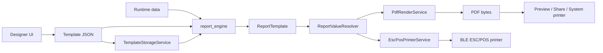

# Code Walkthrough

This document explains the current `flutter_report_suite` architecture, the runtime data flow, the Flutter platform layer, and the test/CI boundaries.

## 1. Repository map

```text
flutter_report_suite/
├── .github/workflows/ci.yml
├── apps/
│   └── designer/
│       ├── android/
│       ├── ios/
│       ├── web/
│       ├── macos/
│       ├── windows/
│       ├── linux/
│       ├── assets/templates/
│       ├── lib/
│       │   ├── main.dart
│       │   └── pages/designer_page.dart
│       └── test/designer_page_test.dart
├── packages/
│   └── report_engine/
│       ├── assets/templates/
│       ├── example/
│       ├── lib/
│       │   ├── report_engine.dart
│       │   └── src/
│       │       ├── models/report_template.dart
│       │       ├── services/
│       │       │   ├── report_value_resolver.dart
│       │       │   ├── pdf_render_service.dart
│       │       │   └── template_storage_service.dart
│       │       └── printer/
│       │           ├── printer_service.dart
│       │           └── esc_pos_printer_service.dart
│       └── test/
│           ├── report_template_test.dart
│           ├── report_value_resolver_test.dart
│           ├── pdf_render_service_test.dart
│           └── printer_service_test.dart
└── docs/
    ├── CI.md
    └── CODE_WALKTHROUGH.md
```

The repository is split into two responsibilities:

- `apps/designer`: visually authors the report contract.
- `packages/report_engine`: consumes that contract and produces output.

The Designer depends on the engine. The engine never depends on the Designer.

---

## 2. End-to-end flow



Example runtime data:

```dart
final data = {
  'shop': {'name': 'Dexter Coffee', 'branch': 'Nimman'},
  'orderId': 'ORD-001',
  'items': [
    {'name': 'Latte', 'qty': 2, 'price': 65},
  ],
  'total': 130,
};
```

Example dynamic element:

```json
{
  "id": "shop-name",
  "type": "dynamic_text",
  "key": "{{shop.name}}",
  "x": 5,
  "y": 5,
  "w": 70,
  "h": 8,
  "style": {
    "fontSize": 14,
    "bold": true,
    "align": "center"
  }
}
```

`{{shop.name}}` resolves to `Dexter Coffee` at render time.

---

## 3. Public engine API

Canonical entrypoint:

```dart
import 'package:report_engine/report_engine.dart';
```

`lib/report_engine.dart` exports the supported application-facing concepts:

- template models
- value resolver
- PDF renderer
- Hive template storage
- system printer facade
- ESC/POS Bluetooth printer service

`flutter_offline_report.dart` remains only as a deprecated compatibility export.

---

## 4. Template contract

File:

```text
packages/report_engine/lib/src/models/report_template.dart
```

### `PaperConfig`

Owns the output surface:

```text
type
widthMm
heightMm
autoHeight
marginMm
```

### `ReportElement`

Owns one report item:

```text
id
 type
key
x / y
w / h
style
columns
```

Geometry is persisted in millimeters. The Designer scales millimeters for display; the PDF renderer converts millimeters to PDF points.

### `ReportTemplate`

Combines:

```text
id
version
paper
elements
```

Parsing is defensive and serialization is supported through `toJson()`.

This model is the shared contract between the visual Designer and every output path.

---

## 5. Value resolution

File:

```text
packages/report_engine/lib/src/services/report_value_resolver.dart
```

Example:

```dart
const resolver = ReportValueResolver();
final name = resolver.resolve('{{shop.name}}', data);
```

Nested paths are walked segment by segment. Missing values resolve to an empty value instead of throwing.

Literal and dynamic elements are intentionally different:

```json
{"type":"text","key":"Thank you"}
```

is literal text, while:

```json
{"type":"dynamic_text","key":"{{customer.name}}"}
```

is resolved from runtime data.

PDF and ESC/POS use the same resolver so expression semantics cannot drift between output channels.

---

## 6. PDF rendering

File:

```text
packages/report_engine/lib/src/services/pdf_render_service.dart
```

Primary API:

```dart
final bytes = await PdfRenderService().render(templateJson, data);
```

The renderer:

1. loads fonts with fallback behavior
2. parses `ReportTemplate`
3. resolves data expressions
4. converts millimeter geometry to PDF units
5. builds thermal or paged PDF output
6. returns `Uint8List`

Supported concepts include text, dynamic text, lines, tables, QR codes, and Code 128 barcodes.

Thermal documents use the configured width and content-driven height. A4/custom documents use paged rendering.

---

## 7. System printing

File:

```text
packages/report_engine/lib/src/printer/printer_service.dart
```

`FlutterReportPrinter` is the application facade over PDF generation and the `printing` package.

```dart
final printer = FlutterReportPrinter();
final bytes = await printer.generatePdf(
  templateJson: template,
  data: data,
);
```

Other operations:

```text
preview()
printDirect()
sharePdf()
listPrinters()
```

`printDirect()` requires a real `Printer` selected by the caller instead of constructing an invalid empty printer URL.

The PDF renderer is injectable, allowing facade behavior to be tested without invoking platform printing APIs.

---

## 8. ESC/POS printing

File:

```text
packages/report_engine/lib/src/printer/esc_pos_printer_service.dart
```

Flow:

```text
template + data
    ↓
ReportValueResolver
    ↓
esc_pos_utils_plus
    ↓
ESC/POS bytes
    ↓
BLE writable characteristic
    ↓
thermal printer
```

The service owns Bluetooth scanning, connection, service discovery, writable-characteristic selection, chunked writes, and disconnect cleanup.

BLE output is written in bounded chunks instead of one arbitrarily large buffer.

Table elements use configured table columns so their semantics stay close to PDF tables.

`buildQuickReceipt()` remains a convenience path for non-template receipts.

---

## 9. Offline storage

File:

```text
packages/report_engine/lib/src/services/template_storage_service.dart
```

Hive stores template JSON offline.

```dart
final storage = TemplateStorageService();
await storage.init();
await storage.saveTemplate('receipt', template);
final cached = await storage.getTemplate('receipt');
```

The service reuses a typed box rather than reopening it for every call.

Rendering remains storage-agnostic: a template may come from assets, Hive, an API, or memory.

---

## 10. Designer application

Files:

```text
apps/designer/lib/main.dart
apps/designer/lib/pages/designer_page.dart
```

The page owns the current document state:

```text
paper type
paper dimensions
auto-height
elements
selected element
preview mock data
```

Authoring controls currently support:

```text
Text
Dynamic field
Line
Table
QR code
Barcode
```

New table elements receive default column definitions so exported table JSON is renderable immediately.

The canvas invariant is:

```text
model geometry = millimeters
screen geometry = millimeters × canvas scale
```

Drag updates convert screen deltas back into model millimeters and clamp the element within the available paper width.

The preview button sends the same template JSON to `report_engine` that another consuming application would use. This makes preview an integration boundary between authoring and rendering.

---

## 11. Flutter platform layer

`apps/designer` now contains normal Flutter platform scaffolding for:

```text
android/
ios/
web/
macos/
windows/
linux/
```

These files were generated using Flutter `3.32.7` and `flutter create`, rather than being manually approximated.

Platform directories own native launch/build integration only. Report authoring and rendering behavior stays in Dart.

Typical responsibilities are:

| Platform | Native/build concern |
| --- | --- |
| Android | Gradle, manifest, launcher activity, resources |
| iOS | Xcode project, plist, app delegate, assets |
| Web | bootstrap HTML, icons, manifest |
| macOS | Xcode project, runner, entitlements |
| Windows | CMake runner and Win32 host |
| Linux | CMake and GTK runner |

Platform-specific Bluetooth permissions or production signing still belong to the host application configuration.

---

## 12. Test suites

### Engine tests

```text
packages/report_engine/test/report_template_test.dart
packages/report_engine/test/report_value_resolver_test.dart
packages/report_engine/test/pdf_render_service_test.dart
packages/report_engine/test/printer_service_test.dart
```

They cover four boundaries:

1. **Contract** — parsing, defaults, serialization.
2. **Expression semantics** — nested paths and missing values.
3. **PDF output** — a minimal template produces real PDF bytes.
4. **Facade delegation** — `FlutterReportPrinter.generatePdf()` delegates to an injected renderer.

The pure model/resolver tests isolate business semantics from plugins and native APIs.

### Designer widget tests

```text
apps/designer/test/designer_page_test.dart
```

They verify:

- Designer boots with the expected authoring controls.
- Adding text selects the element and opens editable properties.
- Tables default to `{{items}}`.
- Export JSON reflects the current document.

The suite pins a desktop-sized test viewport so the responsive layout is deterministic in headless CI.

---

## 13. CI gates

Workflow:

```text
.github/workflows/ci.yml
```

Quality jobs:

```bash
# report_engine
flutter pub get
flutter analyze
flutter test --coverage --reporter expanded

# designer
flutter pub get
flutter analyze
flutter test --coverage --reporter expanded
```

Cross-platform compile smoke jobs:

```text
Web      -> flutter build web --release
Android  -> flutter build apk --debug
Linux    -> flutter build linux --release
Windows  -> flutter build windows --release
macOS    -> flutter build macos --release
iOS      -> flutter build ios --simulator --debug
```

The iOS build targets the simulator, so CI does not need signing credentials.

See `docs/CI.md` for runner details and local equivalents.

---

## 14. Debugging map

Use this to narrow failures quickly:

```text
Template/resolver test fails
    -> contract or expression semantics

PDF test fails
    -> renderer or PDF dependency

Designer widget test fails
    -> authoring UI/state behavior

Web/desktop/mobile build fails
    -> platform/plugin/build configuration

PDF works but ESC/POS fails
    -> BLE transport, capabilities, or printer compatibility
```

This separation prevents a native build issue from being mistaken for a template-engine issue.

---

## 15. Where to change code

| Requirement | Primary location |
| --- | --- |
| Add template field | `report_template.dart` |
| Change expression behavior | `report_value_resolver.dart` |
| Add PDF rendering behavior | `pdf_render_service.dart` |
| Change system print/share | `printer_service.dart` |
| Change BLE/ESC-POS output | `esc_pos_printer_service.dart` |
| Change offline persistence | `template_storage_service.dart` |
| Add Designer authoring control | `designer_page.dart` |
| Add engine regression test | `packages/report_engine/test/` |
| Add Designer behavior test | `apps/designer/test/` |
| Change platform host config | corresponding platform folder |
| Change CI gates | `.github/workflows/ci.yml` |

A template-contract feature normally touches at least:

```text
model
  +
Designer authoring
  +
renderer(s)
  +
tests
```

---

## 16. Recommended next refactor

`DesignerPage` still owns UI, document state, mutation logic, serialization, and preview orchestration.

After the current CI matrix is green, a useful next split is:

```text
apps/designer/lib/
├── models/designer_document.dart
├── controllers/designer_controller.dart
├── pages/designer_page.dart
└── widgets/
    ├── designer_canvas.dart
    ├── element_palette.dart
    ├── properties_panel.dart
    └── paper_toolbar.dart
```

That extraction should preserve behavior behind the widget tests added in this refactor.

The key dependency rule remains unchanged: the Designer may depend on `report_engine`; `report_engine` must remain UI-independent.
